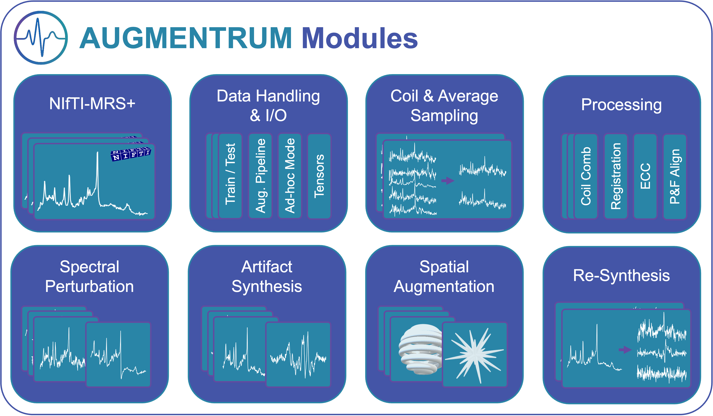

<div align="center">
  
  <h1 style="margin-top: 5px; margin-bottom: 5px;">Augmentrum</h1>
  <p style="margin-top: 0px;"><em>A Data Augmentation Package for MR Spectroscopy</em></p>
  
  [](https://badge.fury.io/py/augmentrum)
  [](https://www.python.org/)
  [](LICENSE)
  [](https://submissions.mirasmart.com/ISMRM2026/Itinerary/PresentationDetail.aspx?evdid=1450)
</div>

---

## Overview
**Augmentrum** is a modular Python framework designed to help researchers with limited *in-vivo* MRS data create diverse, physically consistent datasets through flexible augmentation. It supports **k-space resampling**, **coil and average sampling**, **signal-level perturbations**, and **synthetic artifact generation**, expanding both synthetic and *in-vivo* data in a realistic and controlled manner.

<div align="center">
  
</div>

Built for data-driven MRS applications, Augmentrum streamlines the integration of data augmentation into existing workflows. It operates on the **NIfTI-MRS** standard, making it compatible with any acquisition format. Simply load your data as NIfTI (using `spec2nii` if needed) and apply either predefined augmentation settings or build a custom pipeline by combining modules. Each augmentation can be parameterized or used with default ranges to populate a dense and diverse dataset environment.

From MRSI reconstruction and acquisition variability to spectral perturbations and artifact synthesis, Augmentrum handles it all in a **modular**, **flexible**, and **easy-to-use** structure. Dataloaders allow **on-the-fly augmentation** for deep learning backends such as **PyTorch**, **TensorFlow**, **Keras**, and **JAX**, enabling robust training beyond static datasets.

> **Note:** Augmentrum is currently in **alpha development**. It is an active research framework and may undergo changes as modules and interfaces evolve.

---

## Features
- Modular augmentation across time, frequency, and k-space domains  
- Physically valid transformations for realistic variability  
- Native NIfTI-MRS I/O and metadata tracking  
- Customizable pipelines with user-defined parameters  
- On-the-fly augmentation for machine learning workflows  

---

## Installation
```bash
pip install augmentrum
```
or from source:
```bash
git clone https://github.com/julianmer/Augmentrum.git
cd Augmentrum
pip install -e .
```

---

## Quick Start
```python
from augmentrum import Augmentrum

data   # list of NIfTI-MRS files
water   # list of corresponding water reference files (optional)

# custom pipeline example
pipeline = [
    'coil_sampling',
    'average_sampling',
    'processing',
    'line_broadening',
    'baseline',
    'noise',
]

# initialize Augmentrum with data and optional water references
augmenter = Augmentrum(data, water=water, pipeline=pipeline)

# get a dataloader for PyTorch with on-the-fly augmentation
train_data = augmenter.get_dataloader(
    batch_size=16,
    shuffle=True,
    backend='pytorch'  # or 'tensorflow', 'keras', 'jax', 'numpy'
)
```

---

## Contact

For questions, issues, or collaborations:

- **GitHub Issues**: [github.com/julianmer/Augmentrum/issues](https://github.com/julianmer/Augmentrum/issues)
- **Email**: jlamaste@gmail.com, j.p.merkofer@tue.nl, kci2104@columbia.edu

---

## Citation
J. T. LaMaster, J. P. Merkofer, K. C. Igwe, "Augmentrum: A Data Augmentation Package for MR Spectroscopy", _International Society for Magnetic Resonance in Medicine (ISMRM)_, Abstract #05685, Cape Town, South Africa, 2026.

---

<div align="center">
  <sub>Built with ❤️ for the MRS community</sub>
</div>
